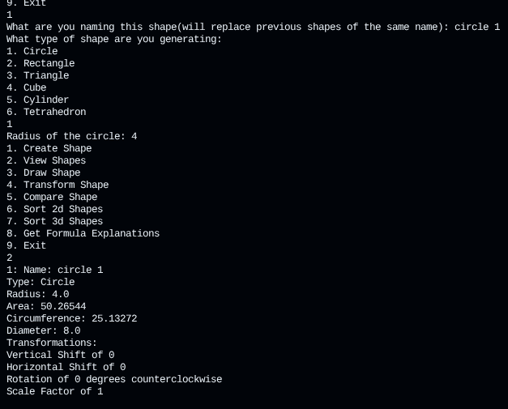

# Geometry Calculator
***

A program for use creating select geometric shapes and finding their information. Can draw some shapes and make comparisons between them.

## Use Instructions
***
1. Run main.py file
2. Select option(create shape reccomended as first)
3. Repeat until done, then leave

## Project Features
***
- Shape calculations
- Shape comparisons and sorting
- Both 2d and 3d shapes
    - Circle, Rectangle, Triangle, Cube, Cylinder, and Tetrahedron
- Limited shape drawing functionality
- Very versatile triangles
- Explanations for how to calculate the shape information

## License Information
***
No copyright

## Contributors
***
- flumph3927